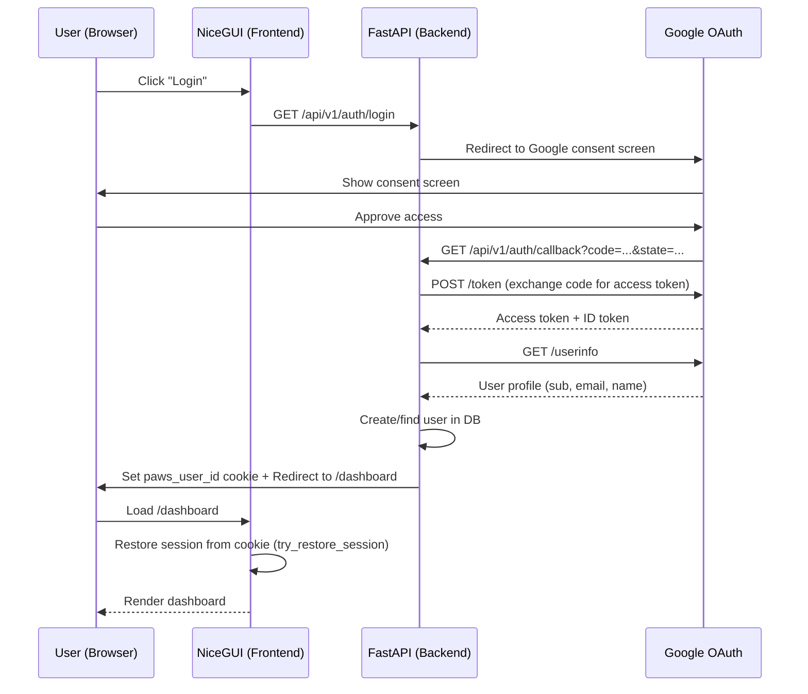
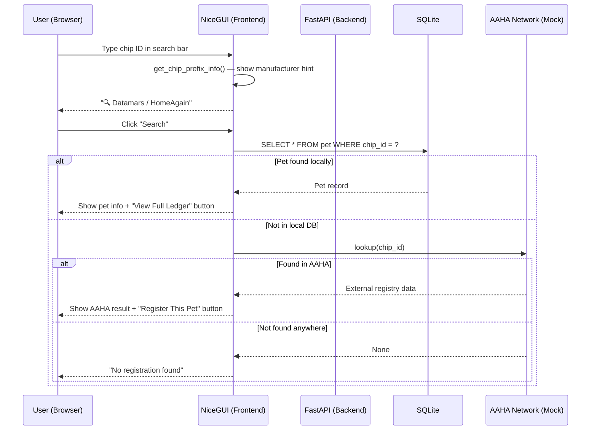
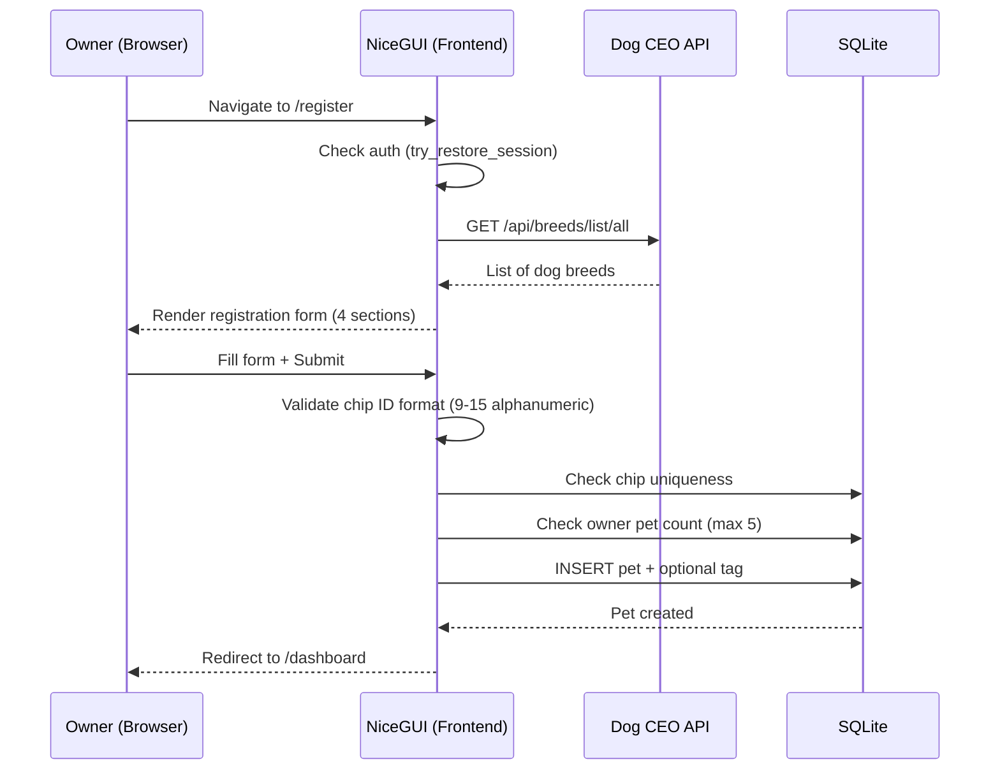
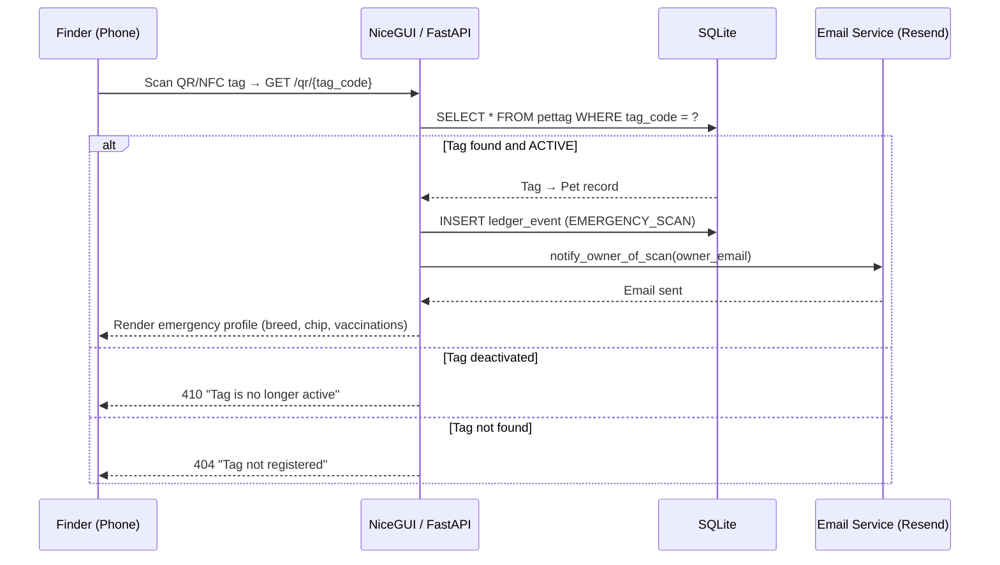
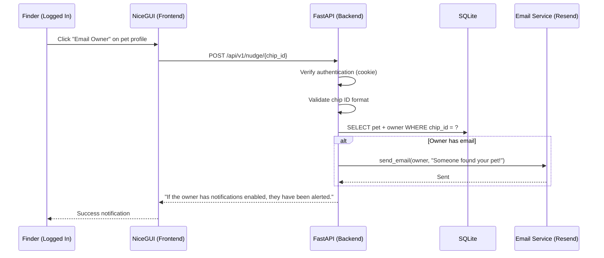
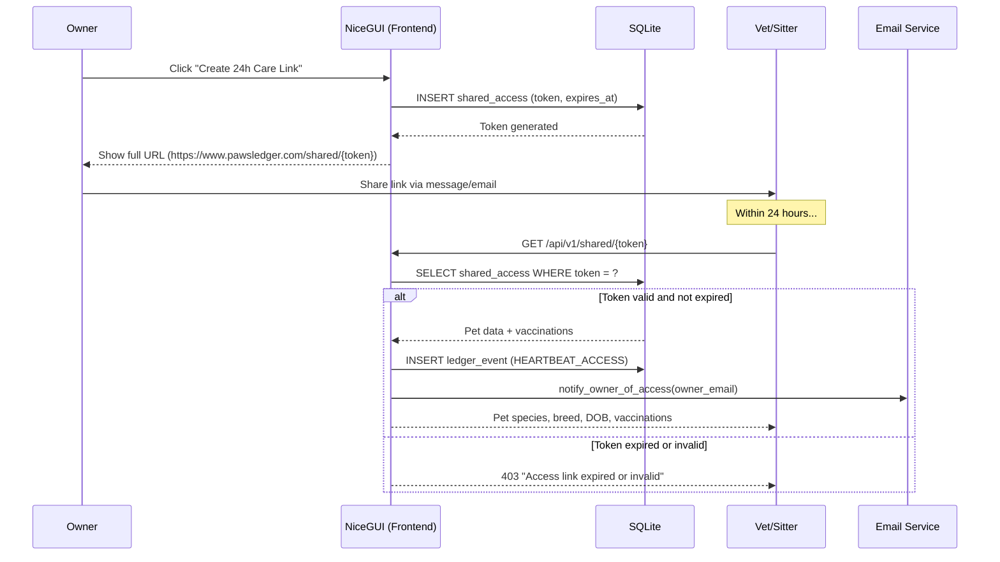
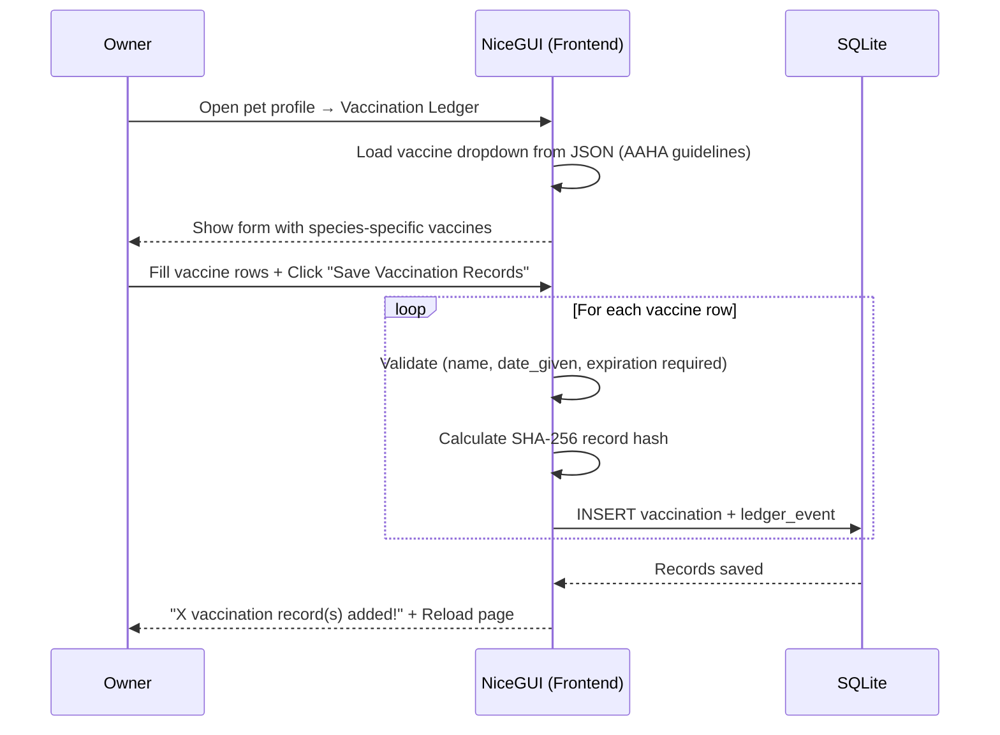
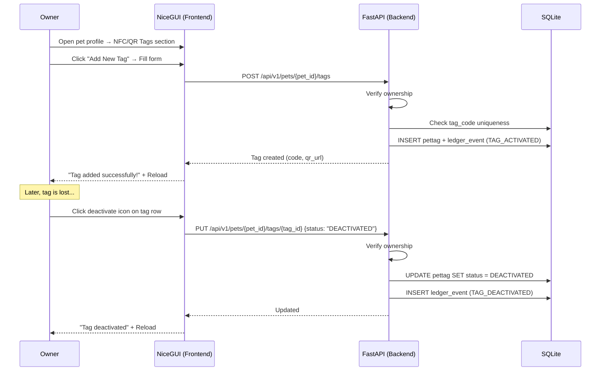
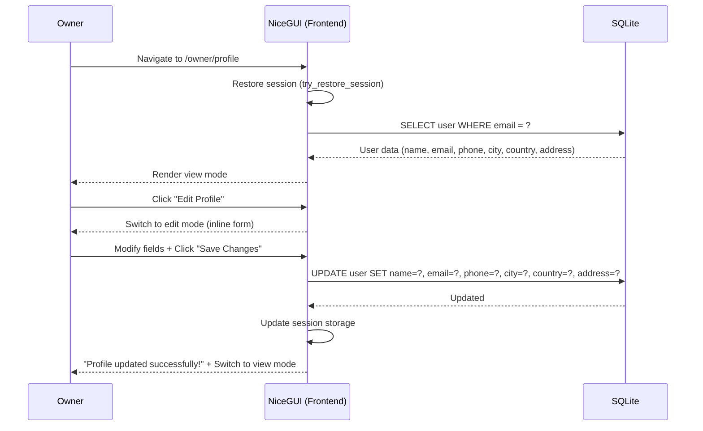
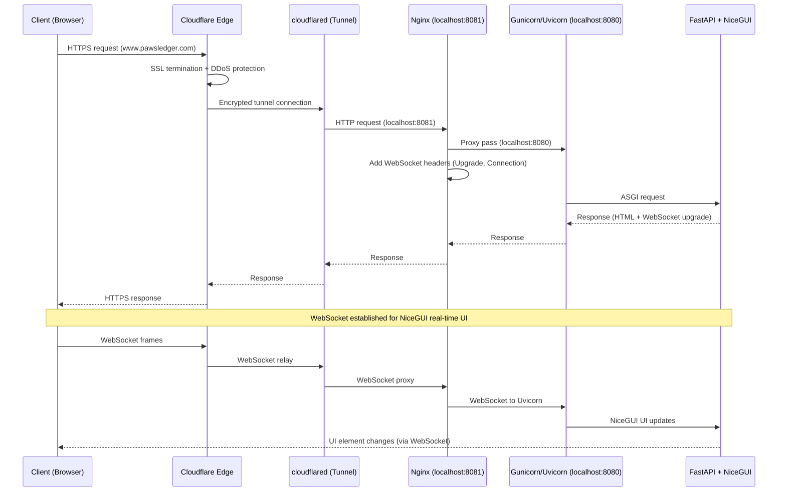

# PawsLedger — Sequence Diagrams

## 1. User Authentication (Google OAuth)

## 2. Microchip Lookup (Landing Page Search)

## 3. Pet Registration

## 4. QR/NFC Tag Scan (Emergency Profile)

## 5. Nudge Owner (Found Pet Flow)

## 6. Shared Access (24h Care Link)

## 7. Vaccination Record Addition

## 8. Tag Management (Add/Deactivate/Remove)

## 9. Owner Profile Update

## 10. Deployment & Request Flow

